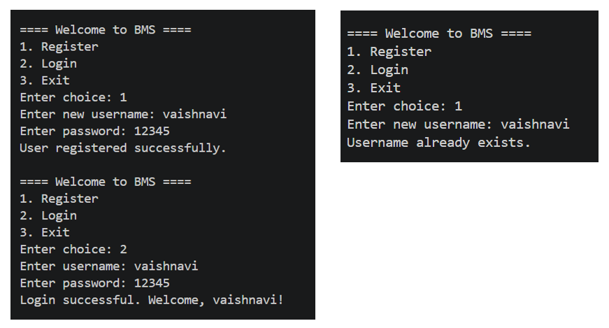
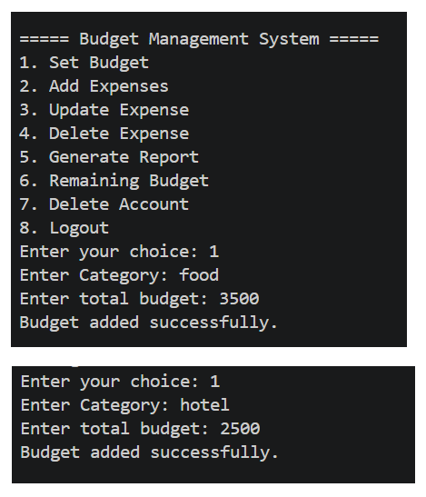
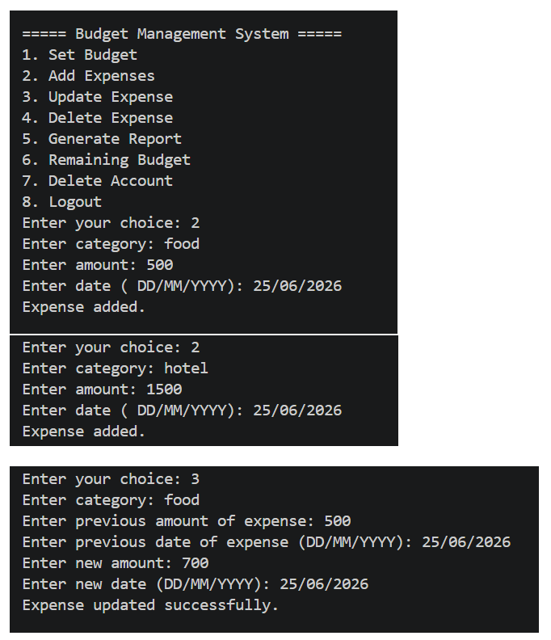
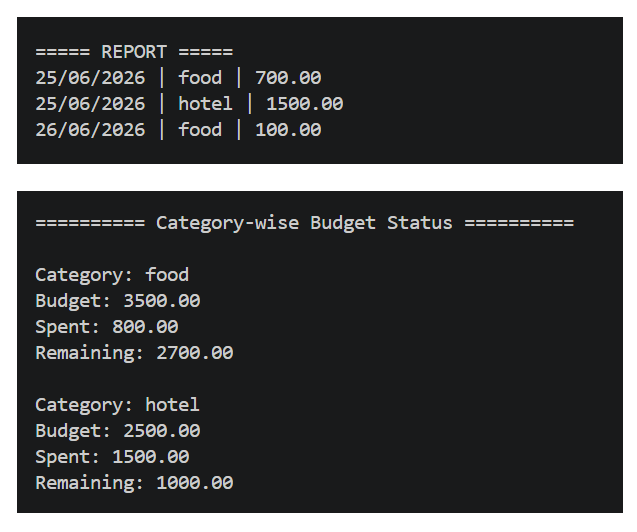
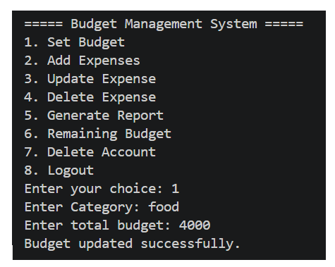
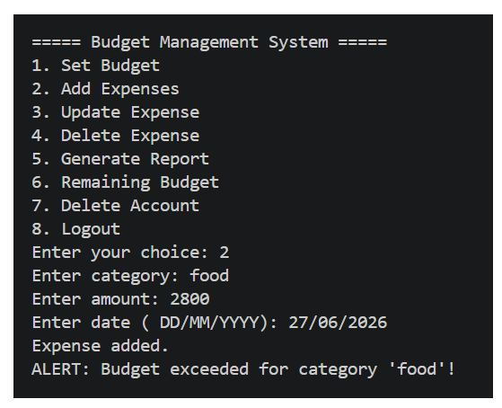

#  Budget Management System for Travelers

A console-based travel expense management application developed in C that helps users manage their travel budget efficiently. The system provides secure user authentication, category-wise budget allocation, expense tracking, budget alerts, expenditure reports, and permanent data storage using file handling.

##  Features

*  User Registration & Login
*  Set Category-wise Travel Budget
*  Add, Update & Delete Expenses
*  Daily Expenditure Reports
*  Remaining Budget Tracking
*  Budget Exceed Alerts
*  File-based Data Storage

##  Tech Stack

- **Language:** C
- **Core Concepts:** Structures, File Handling, Pointers, Dynamic Memory Allocation, Modular Programming, String Manipulation
- **Compiler:** GCC
- **IDE:** Visual Studio Code

##  Project Structure

```text
BMS_PROJECT/
├── data/
│   ├── budgets.txt
│   ├── expenses.txt
│   └── users.txt
├── modules/
│   ├── auth.c
│   ├── auth.h
│   ├── expenses.c
│   ├── expenses.h
│   ├── string_utils.c
│   └── string_utils.h
├── screenshots/
├── main.c
├── README.md
└── .gitignore
```

##  Getting Started

```bash
git clone https://github.com/Vaishnavi-Garg/Budget_management_system.git
cd Budget_management_system
gcc main.c modules/auth.c modules/expenses.c modules/string_utils.c -o bms
./bms
```


##  Screenshots

### Register & Login

<p align="center">
  
</p>

### Set Budget

<p align="center">
  
</p>

### Add & Update Expense

<p align="center">
  
</p>

### Generate Report & Remaining Budget

<p align="center">
  
</p>

### Reset Budget

<p align="center">
  
</p>

### Budget Alert

<p align="center">
  
</p>


##  Author

Vaishnavi Garg

B.Tech CSE (2025–2029)
